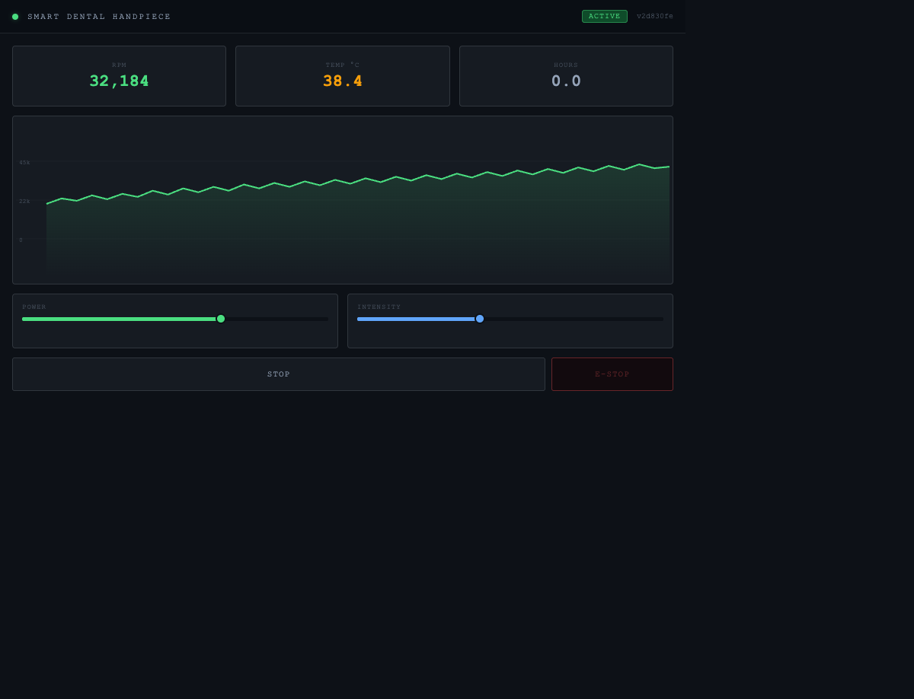

# Smart Dental Handpiece Simulator

A simulated medical device control interface demonstrating MedTech-grade software architecture: layered C++17 HAL, a six-state safety state machine, SQLite audit logging, and a live Qt Quick/QML dashboard.

Built as a portfolio project for MedTech engineering roles.



---

## Architecture

```
QML (main.qml · Dashboard.qml)
        ▲  Q_PROPERTY / NOTIFY
TelemetryBridge          StateManager
        │  ▲                  │  ▲
        │  └── HardwareHandler┘  │
        │                        │
        └──── DatabaseManager ───┘
```

| Layer | Class | Role |
|---|---|---|
| HAL | `HardwareHandler` | Worker-thread sensor simulation (100ms polling) |
| Logic | `StateManager` | Six-state machine with guard conditions |
| Logic | `TelemetryBridge` | Q_PROPERTY bridge + 500ms DB telemetry timer |
| Persistence | `DatabaseManager` | SQLite: sessions / events / telemetry tables |
| Presentation | `main.qml`, `Dashboard.qml` | Dark Clinical QML dashboard with live charts |

Dependency Injection is performed in `main.cpp` — the only file that knows all classes simultaneously.

## State Machine

```
STANDBY → CALIBRATING → READY ↔ ACTIVE
                                     │
                          [temp>60°C / fault signal]
                                     ↓
                                  FAULT ──[3 faults / temp>75°C]──► EMERGENCY_STOP
                                     │                                     │
                              [ack]  ↓                           [manual clear]
                                  STANDBY ◄─────────────────────────────────┘
```

## Building

**Prerequisites:** CMake 3.21+, Qt 6.x with QtCharts module.

```bash
cmake -B build -DCMAKE_BUILD_TYPE=Release
cmake --build build
./build/SmartDentalHandpiece
```

**With tests:**

```bash
cmake -B build -DBUILD_TESTS=ON
cmake --build build
ctest --test-dir build --output-on-failure
```

**Docker (headless Linux):**

```bash
docker build -t smart-dental-handpiece .
docker run --rm smart-dental-handpiece
```

## Database

SQLite audit log written to `data/logs.db`. Three tables:

- `sessions` — one row per power-on cycle, with start/end timestamps and firmware version
- `events` — every state transition and fault with detail string
- `telemetry` — RPM / temperature / usage hours snapshot every 500ms while Active

Inspect with any SQLite client:

```bash
sqlite3 data/logs.db "SELECT * FROM events ORDER BY timestamp DESC LIMIT 20;"
```

## CI/CD

| Trigger | Action |
|---|---|
| PR / push to `main` | Build on Ubuntu + macOS, run unit tests, clang-tidy lint |
| Tag `v*.*.*` | Build Docker image, push to `ghcr.io`, create GitHub Release |

## Manual QML Smoke Test

1. Launch app — window opens with STANDBY state badge
2. Click **POWER ON** — state transitions STANDBY → CALIBRATING → READY within ~0.5s
3. Click **START** — state changes to ACTIVE, vitals update, RPM chart plots live data
4. Sliders are interactive only in ACTIVE state
5. Click **STOP** — returns to READY; chart retains history
6. Click **E-STOP** (or wait for simulated overheat) — red lockout overlay appears
7. Click **CLEAR EMERGENCY & RESET** — returns to STANDBY; check `data/logs.db` for audit trail
